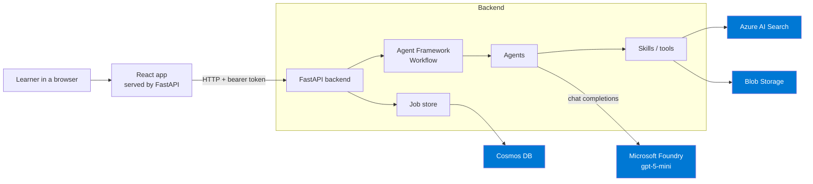
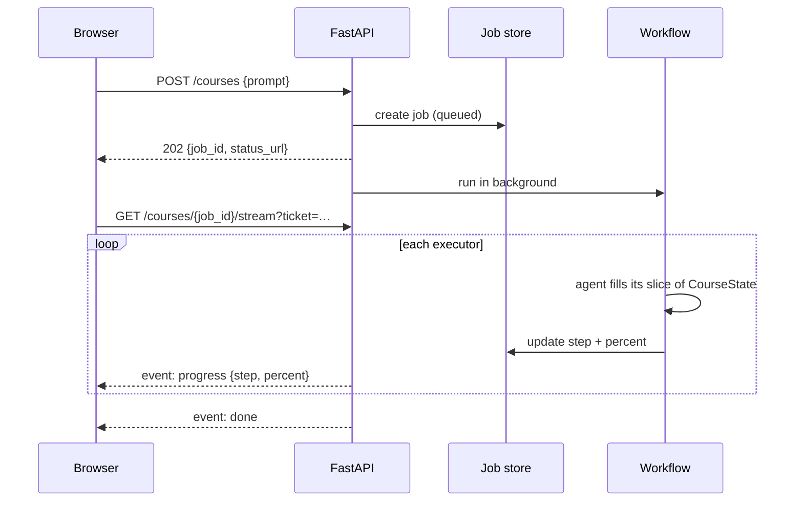
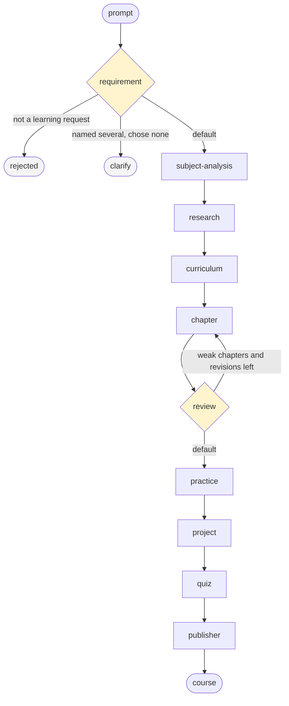

# Mentora AI — Architecture

Source of truth for the design: what we are building, how the pieces fit, what every
agent and skill does, and why the folders are laid out this way.

> Status marks are used only for work that is **not** built. Anything described in the
> present tense exists and is tested; §11 lists what does not. Ticks on individual rows
> rot faster than the prose around them, and a skill once sat here marked done while being
> an empty file.

---

## 1. What we are building

A learner signs in and types this:

```
Teach me Azure AI Search, 30 minutes a day
```

A few minutes later they get back a complete, quality-reviewed course: an outline,
written chapters, practice exercises, portfolio projects, and quizzes. They read it a
chapter at a time, take the quiz on each, and ask follow-up questions that an AI mentor
answers **grounded in that specific course**, not from generic knowledge.

### Why this is not just "call an LLM in a loop"

One giant prompt asking for a whole course produces shallow, repetitive output that
drifts off-topic by chapter three. The quality comes from splitting the job into
narrow steps, each with its own instructions and its own strict output shape, and
then putting a **quality gate** at the end that can send weak chapters back to be
rewritten. That is what the workflow graph in §4 is for.

### Core user journeys

| Journey | Trigger | What happens |
|---|---|---|
| Sign in | Email and password | scrypt-hashed, session is a signed token (§9) |
| Generate a course | "teach me \<skill\>" in the library | Full graph runs, progress streams live |
| Read a chapter | Click it in the contents | Opens over the page; the whole book arrived in one response |
| Take a quiz | Button in the chapter | Marked on the server, so a score cannot be forged |
| Ask the mentor | Question box in the course | Answers from that course, or says it does not cover it |

---

## 2. High-level architecture



The app and the API are **one deployable**. FastAPI serves the built React bundle from
`backend/static`, so there is one origin, one url and no CORS. The app's own routes live
under `/read` because `/courses/{id}` is already the API's, and one url cannot mean both a
page and a JSON document.

### Hosting model — "Option A"

There are two ways to run agents with Microsoft Foundry. We chose the first:

| | **Option A — chosen** | Option B — hosted agents |
|---|---|---|
| Where agents run | In our FastAPI process | Inside Foundry |
| Foundry's role | Model provider only | Runtime + model |
| Orchestration | Our code, fully visible | Foundry-managed |
| Debugging | Local breakpoints work | Remote traces |
| Cost | Only tokens | Tokens + hosting |

**Why:** we own the orchestration logic and can debug it locally, and agent code stays
portable if any one agent later needs to run somewhere else.

---

## 3. Request lifecycle

Course generation takes minutes, and HTTP requests time out. So generation is
**asynchronous**: the API accepts the job, returns immediately, and the client watches.



The learner never sends their own id. It comes from the token (§9), and no route accepts
it from the caller.

Progress is **streamed**, not polled: ten steps over several minutes meant a client asking
every two seconds spent nearly all of it being told nothing had changed. `EventSource`
cannot send an `Authorization` header, so the stream is opened with a sixty-second ticket
that works on nothing else. The client falls back to polling if the stream cannot be
opened, because a proxy that strips `text/event-stream` would otherwise leave the page
silent.

### Job states

| Status | Meaning |
|---|---|
| `queued` | Accepted, not started |
| `running` | Graph in flight |
| `completed` | Course published |
| `failed` | Something broke — `error` field explains |
| `rejected` | Prompt wasn't a learning request. **Not an error**, so kept separate from `failed` |
| `needs-choice` | The learner named several skills and picked none. `options` lists them |

`rejected` exists because "what's the weather in Pune?" is a perfectly valid thing for a
user to type. Treating it as a failure would produce a scary error message for ordinary
small talk.

`needs-choice` is separate again: we understood the message and can help, we just must not
guess. "Teach me React or maybe Vue" is a question, and answering it with a course is a
decision the learner never made. The options are stored as a **list**, not only inside the
sentence, so the app can offer them as buttons without re-parsing prose.

A run lives in a `BackgroundTasks` task, which dies with the process while its job row goes
on saying `running`. Startup closes those out as `failed`, because a learner watching a bar
that will never move is worse than being told the run was lost. `needs-choice` and
`needs-confirmation` are left alone: they are waiting on the learner, not on a worker.

---

## 4. The workflow graph

This is the heart of the system. Each node is an **executor**; each executor wraps one
agent (or one deterministic step).



### Two things worth understanding

**The review loop.** `review-agent` scores every chapter and averages them. Chapters below
`PASSING_REVIEW_SCORE = 75` go back to `chapter-agent`, carrying the reviewer's objections
with them. `MAX_REVISIONS = 2` caps this so a stubbornly low score can't spin forever. This
single loop is the main reason output quality is decent rather than "first draft".

Review sits **directly after `chapter`**, not at the end of the pipeline. Everything
downstream (`practice`, `project`, `quiz`) is generated *from* finished chapter prose, so
putting them inside the loop would re-pay for all of them on every revision. On a
20-chapter course that is 42 wasted model calls per revision, 84 across both.

**The two early exits.** `requirement` routes through a **switch-case group**, the same
construct `review` uses, with `subject-analysis` as the `Default`:

- `is_learning_request: false` → `rejected`, a friendly "I couldn't tell what you'd like
  to learn".
- no single skill to build on → `clarify`, which asks for one. That is one signal,
  `_needs_clarification`, covering three cases: `missing_requirements` is non-empty, the
  learner offered several skills and chose none, or `skill` came back null.

The question itself is assembled in code, not by a second model call — node 1 already
reported what is missing, and another call would be another chance to change the subject.

Both land at **5%**, after a single model call and before anything is generated. Asking
costs one call; guessing costs a whole course on a subject nobody chose.

Switch-case rather than three sibling conditions for two reasons. Sibling conditional edges
are evaluated one at a time and delivered before the next is tested — the bug that made the
review loop run its tail twice. And with three branches, "the conditions are exact
opposites" stops being checkable by eye; `Default` makes it structural, so no prompt can
fall through to no branch at all.

### State-as-message

Every executor receives the **same** `CourseState` object, fills in its own slice, and
forwards it:

```python
@handler
async def run(self, state: CourseState, ctx: WorkflowContext[CourseState]) -> None:
    state.request = await extract_requirement(state.prompt)
    state.mark(WorkflowStep.REQUIREMENT)
    await ctx.send_message(state)
```

> ⚠️ **Verified: Agent Framework passes state by reference — there is no copy.**
> Serial execution is safe. But `practice`, `project` and `quiz` are logically
> independent and tempting to run in parallel — doing so with a shared object
> would race. Parallelising requires per-branch state objects plus a merge step. Flagged,
> not yet designed.

### Progress reporting

Each step carries a weight; the weights sum to 100 (enforced by a test). Executor ids are
the `WorkflowStep` string values, so `event.executor_id` maps straight to a progress step.

| Step | Weight | Step | Weight |
|---|---|---|---|
| requirement | 5 | project | 10 |
| subject-analysis | 5 | quiz | 8 |
| research | 10 | review | 11 |
| curriculum | 10 | publisher | 3 |
| chapter | 30 | | |
| practice | 8 | | |

`chapter` is 30 because writing full prose for every chapter dominates the runtime.

---

## 5. Agents

An **agent** is an LLM with a job description: a name, a system prompt, a strict output
schema, and optionally some tools. Nine agents form the graph, one (`publisher`) is
deterministic and needs no LLM, and one (`mentor`) lives outside the graph entirely.

| # | Agent | Reads from state | Writes to state |
|---|---|---|---|
| 1 | `requirement-agent` | `prompt` | `request` |
| 2 | `subject-analysis-agent` | `request` | `subject`, `sources`, `subject_trace` |
| 3 | `research-agent` | `request`, `subject` | `research` |
| 4 | `curriculum-agent` | `research`, `subject` | `curriculum` |
| 5 | `chapter-agent` | `curriculum`, `research` | `chapters` |
| 6 | `practice-agent` | `chapters` | `practice` |
| 7 | `project-agent` | `curriculum`, `subject` | `projects` |
| 8 | `quiz-agent` | `chapters` | `quizzes` |
| 9 | `review-agent` | `chapters` + `curriculum` | `review` |
| — | `publisher` (no LLM) | `curriculum`, `chapters`, `practice`, `projects`, `quizzes` | `published` |
| — | `mentor-agent` (outside graph) | a published course | — |

### 1. `requirement-agent`

Turns a free-text message into structure. **This is the only agent that sees raw user
input**, which makes it the security and sanity boundary for everything downstream.

Output — [`LearningRequest`](../backend/workflow/state.py):

| Field | Purpose |
|---|---|
| `is_learning_request` | The guardrail. Only required field |
| `skill` | One skill as the learner worded it, e.g. `"Azure AI Search"`. Null when they named none |
| `experience` | beginner / intermediate / advanced / **unknown** |
| `experience_evidence` | The words that raised `experience`. Null when unknown |
| `goal` | What they want to be able to *do* |
| `daily_minutes` | 5–480, drives course pacing. Null when unstated |
| `language` | ISO 639-1 code — `"hi"`, not `"Hindi"` |
| `alternatives` | Skills offered as a choice and never chosen between |
| `missing_requirements` | `skill` or `skill_choice` — what must be asked for |

The contract: **node 1 captures the user's intent, it does not determine the truth about
the subject.** Every field is an observation about the *message*. Working out what
"Microsoft Agent Framework" actually is belongs to the next node, and it cannot do that if
this one quietly substitutes a product the model has heard of.

Design points that turned out to matter a lot:

- **Only `is_learning_request` is required; everything else defaults.** The model is
  never forced to invent a skill for a prompt that has none. This is what stops
  "what's the weather" becoming a weather course.
- **`missing_requirements` is the "I don't know" branch for the skill itself.** Without it,
  a required `skill` turns *"Teach me Microsoft stuff"* into `"Azure"` — the same mechanism
  that turned Microsoft Agent Framework into Bot Framework one node later. A broad vendor,
  ecosystem or category is recognised as a learning request but never narrowed.
- **`experience` has a fourth value, `unknown`, and evidence to go with it.** Defaulting a
  silent message to `beginner` was a claim the learner never made. The beginner assumption
  still exists, but as `LearningRequest.assumed_level`, in one place, where it is visible.
- **Pydantic `Field(description=...)` is the real prompt.** The descriptions become the
  JSON schema the model sees. The `language='English'` bug was fixed purely by writing
  *"ISO 639-1 code… not the language name"* in a field description — no prompt text changed.
- **`alternatives` exists because this is the only node that can see the choice.**
  Downstream nodes read a single skill — so once this agent picks one of
  *"React or maybe Vue"*, the fact that Vue was ever mentioned is gone for good. Measured
  live: *"React or maybe Vue"*, *"either Terraform or Bicep"* and *"python or java or go"*
  all populate it; *"React with TypeScript"* and *"Azure Functions and how to deploy them"*
  correctly do not, because those belong in one course. 9 of 9 on the first run.

Verified live on four cases including Hindi input and an off-topic prompt.

### 2. `subject-analysis-agent`

Sizes the topic before any content is written: category, true difficulty,
prerequisites, estimated hours, career paths. Downstream agents need this to pitch the
material correctly — a course on Kubernetes operators for someone who already uses
Kubernetes daily should not open with "what is a container".

It is the first node that **reads a field an earlier agent wrote**. `build_prompt()`
renders `LearningRequest` into text; the learner's raw message is never seen again.

Two things this node pinned down:

- **`difficulty` is the skill's, `experience` is the learner's.** Without an explicit
  field description the model kept echoing the learner's level back.
- **Prerequisites must be real blockers.** The first live run listed "ability to use a
  text editor" for Markdown. Fixed in the field description, not the prompt — same
  lesson as the `language` bug.

It is reached by the `Default` branch of `requirement`'s switch-case, so it runs for every
prompt that neither early exit claimed. A test asserts the two exit conditions can never
both fire for the same request.

### 3. `research-agent`

Gathers trusted sources — official docs, Microsoft Learn, GitHub, reputable blogs. This is
the **grounding** step: it exists so chapters are written from real, citable material
instead of the model's recollection.

Unlike the first two agents it is a **pipeline, not a single call**:

1. **Propose** — the model suggests six to eight sources (`ResearchBundle`).
2. **Verify** — the `research` skill fetches every URL and discards anything that does not
   answer. Deterministic, no model involved.
3. **Rank** — the `ranking` skill scores by source kind and sorts best-first.

Step 2 is not optional. On the first live run the model proposed
`https://learn.microsoft.com/rest/api/search/` — a perfectly plausible Microsoft Learn URL
that returns **404**. Across runs roughly a third of proposed links were dead. A citation
the learner cannot open is worse than no citation, because it looks authoritative.

> ⚠️ **These URLs are attacker-influenced input.** The model chooses them and our server
> fetches them, which is a textbook SSRF path. `is_fetchable()` requires `https` and
> rejects loopback, private, link-local and reserved addresses — including the cloud
> metadata endpoint `169.254.169.254` — before any request leaves the process.

An empty result is a valid outcome: an ungrounded course still beats a failed job, so the
step is marked complete either way.

**Not yet real web search.** The model proposes from memory and we filter. Swapping the
propose step for a real search API or an Azure AI Search index is a change to one function.

### 4. `curriculum-agent`

Designs the chapter list: titles, ordering, learning objectives per chapter, paced against
`daily_minutes`. A separate planning pass beats letting the chapter writer improvise,
because a plan can be checked for coverage and progression before expensive prose is generated.

Two numbers are computed rather than asked for. `plan_chapter_count()` takes one chapter per
area `subject-analysis` found the subject to cover, clamped to `MIN_CHAPTERS..MAX_CHAPTERS`, and
the prompt states it as a fixed requirement. It used to divide a model-supplied
`estimated_hours`, which was measured swinging 40/120/40 on one subject across three runs — a 3x
difference in course length from noise. `tidy()` then trims to the cap and renumbers, so chapter
numbers are ours. The cap matters beyond tidiness: `chapter-agent` writes prose per chapter,
so `MAX_CHAPTERS` bounds the most expensive step in the graph.

The failure modes are deliberately asymmetric. Empty research is survivable — `format_sources`
turns it into an explicit instruction to stay conservative — but a curriculum with no chapters
is not a degraded course, it is a broken one, so it raises.

`starting_point()` is the level adaptation. A general prompt rule telling the model to skip
orientation chapters for experienced learners was measurably ignored; replacing it with a
computed, skill-specific instruction ("the learner already uses X, chapter 1 must start past
that") removed the orientation chapter on the next run.

### 5. `chapter-agent`

The workhorse — writes each chapter's actual content. It is the first step whose cost scales
with the plan: one model call per chapter, which is why `MAX_CHAPTERS` exists and why Cosmos
landed before it.

Chapters are written concurrently through an `asyncio.Semaphore(MAX_CONCURRENT_CHAPTERS)`.
That is safe here in a way a workflow fan-out would not be: each task returns its own
`Chapter` and nothing shared is mutated, whereas parallel executors would all be writing the
one `CourseState`, which MAF passes by reference.

Every call is independent and has no memory of the others, so continuity has to be supplied.
`covered_so_far()` hands each call the earlier chapters' titles and objectives with an
instruction not to re-teach them; `coming_later()` lists the later titles as off limits. Both
decide the branch in Python — first chapter, middle, last — and state only the branch that
applies, the same move that fixed level adaptation in `curriculum-agent`.

Length is computed, not requested: `target_words()` scales the chapter to the learner's
`daily_minutes` so a chapter is roughly one sitting, clamped to `MIN_WORDS..MAX_WORDS`.

The model is never asked for anything already known. `assemble()` takes the number and title
from the outline, so a chapter cannot drift from the curriculum that commissioned it.
Markdown structure is ours too — the model returns titled `ChapterSection`s and `render_body()`
emits the headings, because asking for one Markdown blob produced flat prose with no headings
at all across every live chapter.

A partial course is refused. If any chapter fails, the step raises and names the failed
numbers, because a course silently missing chapter 3 still reads as finished. A chapter is
only counted as failed once it has exhausted the retries described below.

### 6. `practice-agent`

Turns chapters into active recall. Reading a chapter feels like learning; being unable to do
something with it proves you weren't.

Three different parts of the course could plausibly produce "a question", so they are
separated on one axis — **who marks the answer** — and the types enforce it:

| Produced by | Marked by | Ships an answer? |
|---|---|---|
| `Chapter.exercises` | nobody, it's a do-it-now nudge | no |
| `PracticeItem` | the learner, against a worked solution | **yes, `solution: str` is required** |
| `QuizQuestion` | the machine, via `correct_index` | through `correct_index` |

So `PracticeKind` has no multiple-choice member: anything a machine can mark belongs to
`quiz-agent`. The four kinds are `recall`, `apply`, `build` and `diagnose`.

The shape mirrors `chapter-agent` — one call per chapter, four at a time, the same
fail-loudly rule. Two things are computed rather than asked for: the task count is
`plan_task_count()`, one per objective clamped to 2–4, and `chapter_number` is attached
afterwards because we already know it.

Overlap with the chapter's own exercises is prevented the same way `chapter-agent` prevents
re-teaching: the chapter's exercises are listed in the prompt and declared off limits.

#### The shared fan-out

`chapter`, `practice` and `quiz` all make one model call per chapter, so
`backend/agents/fanout.py` holds `per_chapter()`: bounded by a semaphore, gathered with
`return_exceptions=True`, all-or-nothing, failures named by chapter number.

It was deliberately left duplicated until the third caller existed, so the shape is drawn
from three real cases instead of guessed from one. `project-agent` is not per-chapter and
does not use it.

Because all three agents funnel through here, retry lives here too: `MAX_ATTEMPTS = 3` with
exponential backoff. Two details matter more than the retry itself:

- **The delay is jittered.** Four chapters throttled by the same 429 would otherwise all
  wake at the same moment and re-create the burst that caused it.
- **The semaphore is taken per attempt, not per chapter**, so a chapter waiting for a slot
  never queues behind another chapter's backoff. A test pins the resulting call order.

Bugs in our own code (`TypeError`, `KeyError`, …) are not retried — they fail identically
three times and only burn time and tokens. `asyncio.CancelledError` is a `BaseException`,
so `except Exception` lets cancellation through untouched.

The framework wraps everything in `ChatClientException` and exposes no typed rate-limit
error, so a service-supplied `Retry-After` cannot be honoured without depending on
unverified internals. Backoff is blind by choice.

### 7. `project-agent`

Portfolio projects at beginner / intermediate / advanced level, each with features, folder
structure, milestones and stretch goals. This is what makes a course show up on a CV.

**One call, not three.** Chapters, practice and quizzes fan out because each unit is
independent. The three projects are not independent — they are a ramp, and a ramp is a
single design decision. Three separate calls would each reach for the most obvious project
for the skill and return three variations of one idea. So `project-agent` is the one
enrichment agent that does *not* use `per_chapter()`.

**Difficulty is position, not a field.** `LEVELS` fixes the rungs in order, and
`assemble_all()` zips them onto the drafts, so the model is never asked which level a
project is — the ninth thing computed rather than requested. Note that `Project.level` is
how hard the project is *within this course*; how experienced the learner is stays on
`LearningRequest.experience`.

**The tree is drawn in code.** The model returns `files` as plain paths; `folder_structure()`
builds a dict-of-dicts and renders the box-drawing characters. Lining up `├──` and `│` by
hand is exactly the kind of formatting a model gets subtly wrong, and the paths behind it
are not. A path ending in `/` is marked with `DIR_MARKER` so an empty folder is still drawn
as a folder, and entries that are notes rather than names (`data/pdfs/ (place PDFs here)`,
seen live) are dropped with their parent kept as a folder.

### 8. `quiz-agent`

One quiz per chapter plus a final assessment that spans the course — the only part that can
test whether two chapters were joined up. Scored and stored, so progress is measurable
rather than self-reported.

**The model is never asked for `correct_index`.** An index is a claim about a list the model
has to hold in its head while writing it, and that claim is often wrong. It returns
`correct_answer` as *text* plus `distractors`; `assemble()` builds the options, shuffles
them, and computes the index. A question whose marked answer disagrees with its options is
no longer expressible.

The shuffle is seeded on the question text, so a question always renders identically while
the answers still scatter. Without it every answer would sit at index 0, since that is where
we put it.

Question counts follow `key_points`, where practice follows `objectives`. Different anchors
are what stop the two agents testing the same thing: **practice checks the promises the
chapter made, the quiz checks the takeaways it landed.**

A question with too few usable distractors is dropped rather than shipped; a quiz with no
usable questions raises. Short is degraded, empty is broken.

### 9. `review-agent`

The quality gate, and the most important agent after `requirement`. Scores the course and
returns `ReviewResult`:

```python
class ReviewResult(BaseModel):
    score: int
    issues: list[str]
    regenerate_chapters: list[int]            # which chapters to rewrite
    chapter_issues: dict[int, list[str]]      # why, so the rewrite can act on it
    unsupported_claims: dict[int, list[str]]  # what the sources never showed
```

**N+1 calls, not one giant prompt.** A twelve-chapter course is far more prose than one
call can weigh evenly — the last chapters get skimmed. So each chapter is judged alone
(fanned out through `per_chapter`, the fourth caller of that helper) and one extra call
looks at the whole syllabus. That call is the only place cross-chapter faults can be seen.

**The two calls are different agents** because they need different `response_format`s:
`ChapterVerdict` (score + issues) and `CourseVerdict` (issues only).

**The chapter pass is shown the sources.** Judging prose against nothing but itself can only
ask whether it reads well, so a fabricated method explained clearly scored 82: a course once
taught `from agent_framework.workflows import Workflow`, which appears in no source. The
reviewer now gets the same passages the writer had, selected the same way, so a claim counts
as unsupported only when the writer could not have supported it either.

**Claims are reported, not acted on.** Rewriting a chapter because it invented something was
tried and measured: 37% more wall clock, and the run still ended at the revision cap with
every chapter flagged. The writer invents when the sources are thin, and another draft off
the same sources cannot supply what they never had — the fix belongs in retrieval, not here.
The claims still ride along in `chapter_issues`, so a chapter rewritten for a low score does
not reinvent what its last draft invented.

**Nothing is asked for that we already know or can compute.** `ChapterVerdict` has no
`number` field — we know which chapter we sent. `score` for the course is the mean of the
chapter scores rather than a separate question, so there is no second number free to
disagree with the first. `regenerate_chapters` is derived from the scores, never asked
for: judging a chapter and pricing a rewrite are different jobs.

**The course pass is told it cannot see the chapters.** It is given titles and key points
only. Stating "do not report faults inside a chapter" was ignored; naming the mechanism —
*any claim about the prose is a guess about text you were not given, and it will send a
sound chapter back for a fault it does not have* — stopped it.

#### Where the bar came from

`PASSING_REVIEW_SCORE` started at 90 and was wrong. Measured live:

| what | scores |
| --- | --- |
| a good chapter, reviewed three times **unchanged** | 82, 85, 92 |
| three more good chapters, three reviews each | 85–95, 86–95, 86–88 |
| a deliberately hollow chapter | 10, 15, 15 |

The reviewer separates good work from bad by about seventy points, but its precision on
identical text is roughly ±5. A bar of 90 therefore sat *inside* the good band and sent
sound chapters back on a coin flip — at roughly triple the cost. The bar is now **75**:
far above anything a weak chapter scores, and below the reviewer's own noise floor.

#### The loop

```
curriculum ──▶ chapter ──▶ review ─┐
              ▲                │ needs revision
              └────────────────┘
                               │ default
                               ▼
                      practice ──▶ project ──▶ quiz ──▶ publisher
```

- `should_regenerate` keys off `regenerate_chapters` being non-empty, **not** off the
  score. The decision to loop and the work that loop would do therefore cannot disagree —
  a harsh average can never trigger a rewrite of nothing.
- Rewrites carry `chapter_issues` into the prompt. Without them a "rewrite" is just a
  fresh sample of the same prompt and comes back equally weak.
- `splice()` drops rewritten chapters back into place; chapters that passed are untouched.
- `revision_count` is incremented in `ChapterExecutor`, not in `ReviewExecutor`. This
  matters: incrementing at review time means the count rises *before* the edge condition
  re-evaluates `should_regenerate`, which yields one revision instead of two. Counting
  where the rewrite actually happens gives exactly `MAX_REVISIONS` loops.

#### ⚠️ Why review routes with a switch-case, not two conditional edges

The obvious wiring is two `add_edge` calls out of `review` with opposite conditions. It is
wrong, and it fails silently.

MAF evaluates sibling edge conditions **one at a time, delivering each before evaluating
the next** — and delivery runs the whole downstream chain. Because `CourseState` is passed
**by reference**, `chapter` increments `revision_count` *between* the two evaluations.
Traced on a real run:

```
[needs_revision] -> True   (rev_count=1)
[is_good_enough] -> True   (rev_count=2)   <- same message, both branches taken
```

The course went down both edges. `practice`, `project` and `quiz` each ran **twice**, in
two interleaved chains. Every offline test passed throughout — the graph *shape* was
correct, only its behaviour was not.

`add_switch_case_edge_group` fixes it properly: its `selection_func` is called **once** per
message and returns exactly one target, so all conditions are evaluated in a single
synchronous pass before anything is delivered. The pass branch is a `Default`, which means
there is no second condition that could drift out of step with the first.

**The general rule:** with a mutable message shared by reference, two "exactly opposite"
conditions are not mutually exclusive. Use switch-case whenever a branch can be re-entered.

Regression cover lives in
[tests/workflow/test_workflow_loop.py](../tests/workflow/test_workflow_loop.py), which runs
the real graph with every model call stubbed and asserts the tail runs exactly once.

**Known cost:** a revision re-runs only the flagged chapters, plus a full re-review. Nothing
downstream is repeated.

**Known gap:** review reads **chapters only**. Practice, projects and quizzes are never
passed to it. They are all generated *from* chapter prose, so a sound chapter implies sound
derivatives, and the loop can only rewrite chapters anyway — but nothing checks that a quiz
question's answer key is actually correct. That is the sharpest hole in the pipeline.

### `publisher` — deterministic, no LLM

Renders the finished course to a single Markdown document via the `exporter` skill, stores
it, and records the link on `state.published`. **No model involved**, so it lives in
[`backend/workflow/executors.py`](../backend/workflow/executors.py) with the other
deterministic nodes rather than in `agents/`. It is the terminal node, so it yields the
finished state as the workflow's output.

**How the document is laid out.** Grouped by chapter, not by artifact type: chapter prose,
then its key points, its exercises, its practice tasks and its quiz. That is the order
someone actually works through, and practice and quizzes already carry the chapter number
they belong to. `Quiz.chapter_number` was added for exactly this — matching a quiz to a
chapter by parsing its `scope` string would have coupled the exporter to a label written
for display.

**Answers are held back.** Practice solutions and quiz answers are collected into a single
`## Answers` section at the end. A solution printed directly under its task is a solution
the learner reads before attempting the task, which makes the exercise worthless.

**Headings are demoted, but not inside code fences.** A chapter body already contains `##`
headings, so they are pushed down one level to nest under the heading the exporter gives
the chapter. The trap: a shell chapter is full of `# clone the repo` comment lines, and a
naive regex turns them into headings. `demote_headings` tracks fence state and leaves
fenced content alone.

**Orphans are dropped.** A rewrite can remove a chapter, leaving practice and quizzes
pointing at a number the document no longer has. Both are filtered against the chapter
numbers actually present, so the answer key can never grow a heading for a chapter nobody
can read.

PDF and DOCX stay unimplemented — `pdf_url` and `docx_url` are left `None` rather than
filled with the Markdown link. `weasyprint` needs GTK on Windows, which is a bigger
detour than the format is currently worth.

**Storage.** [`blob_storage.py`](../backend/services/blob_storage.py) is keyless like
Cosmos: `DefaultAzureCredential` only, and the account has shared-key access switched off.
That has a consequence — with no account key there is no service SAS, so read links are
**user-delegation SAS** tokens signed with a key requested from Azure. The container is
private and `allow-blob-public-access` is `false`: a course names the employee's own
systems, so a guessable URL must return nothing.

Two numbers were learned the hard way. Azure caps a user-delegation key at **seven days**
and reports anything longer as `InvalidXmlNodeValue`, which reads like a serialisation bug
rather than an expiry problem — the link lifetime is six days, with the key and the token
sharing one window. And the window start is backdated five minutes, because a key that
starts in the future is rejected outright and our clock can sit ahead of Azure's.

[`artifact_store.py`](../backend/services/artifact_store.py) picks the implementation the
same way `course_store.py` does: Blob when `BLOB_ACCOUNT_URL` is set, otherwise files under
`generated_courses/`, so a local run needs no storage account at all.

**Untrusted text in a structured document.** The renderer treats everything a model wrote
as content, never as structure. Chapter bodies get their headings demoted so they nest
under the chapter, skipping fenced code so `# clone the repo` stays a shell comment.
Practice prompts and solutions get the opposite treatment — they are escaped, because a
prompt that quotes a conflicted file arrives as plain prose containing `# Project X`, a row
of `=` and `>>>>>>> feature-branch`, which Markdown reads as a heading, a *setext* heading
and a block quote. The stray heading is the damaging one: it lands in the document outline
above the chapter that contains it. Both behaviours were found by reading a real generated
course, not by a fixture.

**Shutdown.** Every service holding a cached client exposes a `close_*` coroutine, and
[`lifespan`](../backend/main.py) calls all of them. `tests/test_lifespan.py` walks
`backend.services` and fails if one exists that lifespan does not call — naming them by
hand would pass on the day it was written and miss the next service, which is exactly how
`close_blob_storage` came to be written and never wired up.

### `mentor-agent` — outside the graph

Everything above runs **once**, to build a course. The mentor runs **forever after**,
answering questions grounded in that learner's course. It is served by `/mentor`, not by
the workflow. This is the feature that turns a one-off document into an ongoing
relationship.

Its safety is one field: `grounded`. A required `answer: str` on its own is a demand for an
answer, so a model asked about something the course never covered returns its nearest
recollection instead. When the course falls short and the question is still about the
subject, it may go and read — and says so. When the question is off-subject it refuses.

Retrieval is fetched **once** per question, over the chapters and the pages they were
written from together. It used to ask twice, once per corpus; the index is searched by
course rather than by corpus, so the second call returned the same passages again and half
the prompt repeated itself under a different heading.

---

## 6. Skills

### Agent vs skill — the distinction

| | Agent | Skill |
|---|---|---|
| Is | An LLM with a job | A reusable capability |
| Has | Prompt + output schema | A function signature |
| Deterministic? | No | Often yes |
| Reused? | Owns one graph node | Called by several agents |

The rule: **if it can be done without a model, or is needed by more than one agent, it's a
skill.** Skills keep agents thin and make the deterministic parts unit-testable without
spending tokens.

| Skill | Used by | What it does |
|---|---|---|
| `passages` | chapter, mentor, review, retrieval, course-index | Selects the passages a prompt is given |
| `ranking` | research-agent | Scores and orders sources by trust and relevance |
| `diagrams` | chapter-agent | Turns a diagram's parts into Mermaid |
| `grounding` | review-agent | Checks claims against the retrieved text |
| `exporter` | publisher | Course → one Markdown document |

Everything else an agent does is a model call, and lives in `backend/agents/`. A skill earns
its place by being called; an empty package named after an intention reads like work that
has been done.

---

## 7. Shared state contract

[`backend/workflow/state.py`](../backend/workflow/state.py) is the contract binding all
agents. **Changing a model here changes the prompts downstream**, because these schemas
*are* what the models see.

```python
class CourseState(BaseModel):
    job_id: str
    user_id: str
    prompt: str                                  # what the learner typed

    request: LearningRequest | None              # agent 1
    subject: SubjectAnalysis | None              # agent 2
    research: list[ResearchSource]               # agent 3
    curriculum: Curriculum | None                # agent 4
    chapters: list[Chapter]                      # agent 5
    practice: list[PracticeItem]                 # agent 6
    projects: list[Project]                      # agent 7
    quizzes: list[Quiz]                          # agent 8
    review: ReviewResult | None                  # agent 9
    review_rounds: list[ReviewRound]             # one entry per review pass
    published: PublishedCourse | None            # publisher

    completed_steps: list[WorkflowStep]          # drives percent
    revision_count: int                          # caps the review loop
```

Two helpers carry real logic:

- `mark(step)` — records a finished step, **ignoring duplicates**. The review loop revisits
  `chapter`, so without this guard progress would creep past 100%.
- `should_regenerate` — `bool(review.regenerate_chapters) and revision_count < MAX_REVISIONS`.
  The loop condition, expressed once, in the state rather than scattered across edges. It
  keys off the work to be done rather than the score, so the decision to loop and the work
  that loop would do cannot disagree.

`review_rounds` exists because only the last `ReviewResult` survives on the state, and
whether a rewrite helped can only be seen by comparing a pass with the one before it.

---

## 8. Folder structure

```
LearnForgeAI/
├── backend/                  FastAPI service — owns the workflow, serves the app
│   ├── api/                  HTTP routers (thin: validate, delegate, return)
│   ├── agents/               One module per agent + its executor
│   ├── skills/               Reusable capabilities, one package each
│   ├── workflow/             Graph definition, shared state, runner
│   ├── prompts/              System prompts as .md files
│   ├── services/             Azure SDK wrappers
│   ├── schemas/              API request/response models
│   ├── models/               Persisted entities
│   ├── config/               Settings from env
│   └── static/               Built React app (gitignored; `npm run build` writes here)
├── frontend/                 React app — library, reader, quiz, mentor
├── tests/                    Mirrors backend/
├── docker/                   Multi-stage build: node builds the app, python serves it
├── scripts/                  Provisioning, backfill, end-to-end smoke
├── docs/                     This file
└── generated_courses/        Local output when Cosmos is not configured
```

### Why each folder exists

**`backend/api/`** — Routers stay thin on purpose: validate input, kick off work, return.
No business logic, so the same logic can later be triggered by a timer or queue instead of
HTTP. `auth.py` · `course.py` · `job.py` · `mentor.py` · `quiz.py` · `progress.py` ·
`stream.py`, plus `deps.py`, which is where every route learns who is asking.

**`backend/agents/`** — One module per agent, each holding the agent factory *and* its
executor. Colocating them means everything about one graph node is in one file. Filenames
stay `snake_case`; Foundry agent `name=` values must be hyphenated (`requirement-agent`),
as Foundry rejects underscores.

**`backend/skills/`** — A package per skill rather than a flat module, so a skill can grow
its own templates, helpers and tests without cluttering others.

**`backend/workflow/`** — The orchestration layer:

| File | Role |
|---|---|
| `state.py` | The shared contract — read this first |
| `workflow.py` | Graph wiring: nodes, edges, conditions |
| `runner.py` | Runs the graph, translates events into job updates |
| `executors.py` | Deterministic non-agent nodes (rejection, publisher) |
| `conditions.py` | Reusable edge predicates |

**`backend/prompts/`** — Prompts are `.md` files, not Python strings. They can be edited,
diffed and reviewed without touching code — a non-developer can improve a prompt in a PR.
`loader.py` caches reads, so **prompt edits need a process restart** to take effect.

**`backend/services/`** — All Azure SDK usage is confined here. Agents and skills never
import an Azure SDK directly, so swapping a provider or faking one in tests touches one file.
`foundry.py` · `job_store.py` · `course_store.py` · `user_store.py` · `progress_store.py` ·
`quiz_store.py` · `cosmos.py` · `blob_storage.py` · `artifact_store.py` · `ai_search.py` ·
`embeddings.py` · `retrieval.py` · `course_index.py` · `security.py`

The stores are **interfaces first, technology second**. Each has two implementations behind
a `Protocol` — Cosmos when `COSMOS_ENDPOINT` is set, in-memory or JSON files otherwise —
and the swap happens on one line at the bottom of each module. No caller changed.
Local development and the whole offline test suite still need no Azure account.

Clients that hold a connection are **cached for the process and closed once**, in the
lifespan. Building one per call costs a TLS handshake before anything can be asked:
measured at 4.4s a search query against 286ms on a shared client.

**`backend/schemas/` vs `backend/models/`** — A deliberate split. `schemas/` is the public
API shape; `models/` is what we persist. Keeping them apart means a database change doesn't
silently alter the public API. `schemas/document.py` is the clearest case: it is a
projection built only from what a reader may see, so the reviewer's verdicts and the quiz
answer keys cannot leave the server by accident.

**`frontend/`** — React and Vite. It talks to the API over HTTP and never assumes anything
about it beyond the types in `src/api/types.ts`. `npm run build` writes into
`backend/static`, which FastAPI serves; in development `npm run dev` proxies the API so the
paths match production.

**`tests/`** — Mirrors `backend/`. Split into two layers:

| Layer | Command | Speed | Proves |
|---|---|---|---|
| Offline (default) | `pytest -q` | ~20s | Wiring, schemas, conditions, authorisation |
| Live (opt-in) | `pytest -m live` | minutes, costs tokens | The *model* behaves |
| Frontend | `npm test` in `frontend/` | ~10s | Rendering and the API client |
| End to end | `python scripts/e2e_smoke.py` | ~25 min, costs tokens | A real course, against a running server |

`pytest.ini` sets `addopts = -m "not live"` so live tests never run by accident.
`tests/conftest.py` pins every endpoint setting to empty, so the offline suite cannot
quietly reach live Azure because a developer happens to have a `.env`.

---

## 9. Azure services

| Service | Purpose |
|---|---|
| Microsoft Foundry | `gpt-5-mini` for every agent, `text-embedding-3-small` for the index |
| Azure AI Search | Hybrid retrieval for the mentor, scoped to one course and one owner |
| Cosmos DB | Users, jobs, courses, progress, scores |
| Blob Storage | Published course Markdown, private, user-delegation SAS links |

Not deployed anywhere yet — see §11.

### Cosmos containers

All partitioned by `/user_id`, because every read is scoped to one learner.

| Container | Holds | TTL |
|---|---|---|
| `users` | Accounts: email, name, scrypt hash | none |
| `jobs` | Generation runs and progress | 30 days |
| `courses` | The generated course | none |
| `progress` | Chapters read, completion | none |
| `quiz_results` | Answers and scores | none |
| `chat_history` | Mentor conversations | 90 days |

**Indexing is opt-in, not default.** Cosmos indexes every property unless told otherwise,
and a `courses` document holds the entire `CourseState` — every chapter of prose. Indexing
that would inflate write cost and storage for paths nothing ever filters on, so
`infra/cosmos/courses-index.json` excludes `/*` and includes only `/user_id`, `/job_id`
and `/created_at`, plus a composite index on `(user_id ASC, created_at DESC)` for the
"my courses, newest first" list.

**Reads are projected.** A stored course runs to hundreds of kilobytes, and the reviewer's
verdicts and quiz answer keys are about a third of it that no reader ever sees. The library
selects a title and a chapter count; the reader selects the chapters and what hangs off
them. Measured on the live account: the library went from 21.0s to 0.67s, and a course read
from 27.5s to 12.5s. A test pins that the projected document is byte-identical to the full
one, so the fast path cannot become a second, drifting definition of a course.

**Auth is keyless.** `DefaultAzureCredential` everywhere; no secrets in `.env`. Note that
Cosmos has a *second* RBAC system for the data plane: subscription `Owner` grants nothing
there, and reads fail with 403 until the Cosmos DB Data Contributor role is assigned.
`scripts/provision_cosmos.ps1` does that as its fourth step.

The account is **serverless, in `eastus2`** — `eastus` refused new accounts with a capacity
error. The script takes `-Location`, so a region swap is a flag rather than an edit.
Measured cost of the two read shapes on the live account: a point read is **1.0 RU**, the
cross-partition fallback **2.82 RU**, and that ratio only worsens as partitions multiply.

Two traps already hit and worth recording:

- **Endpoint.** `*.cognitiveservices.azure.com` is the Speech/Vision/Language endpoint.
  Model inference needs `*.services.ai.azure.com`, **and** `FoundryChatClient` wants the
  full *project* path: `.../api/projects/learnforge`.
- **Quota.** In this subscription every `Standard` SKU quota is 0 — capacity exists only in
  `GlobalStandard`. Deploying with the portal's default fails with a misleading quota error.

### The search index

One index, `course-passages`, holding every chapter of every course as a passage with a
vector. Every query is filtered to one course **and** one owner, so retrieval cannot reach
another learner's material. A course indexes itself when it is generated; `drop_course`
clears the old passages first, because a regenerated course keeps its id.

Retrieval sits behind an interface with two implementations. Lexical set-cover is not a
degraded mode: measured on a real course it answered six of six covered questions in 33ms.
Search earns its place on paraphrase and scale — term coverage 62% against 88% on one
course, and 16% against 82% on another whose research corpus was thin. When the index has
nothing for a course, search falls back to lexical rather than answering from nothing.

**Vectors are 90% of the index**, so their width decides what fits. At 1536 dimensions a
course took 3.92 MB and only twelve fit the tier's 50 MB, after which indexing would have
started failing and swallowing it. `text-embedding-3-small` is trained so a shortened
vector still works: at 512 a course takes 1.51 MB, thirty-two fit, and measured coverage is
unchanged. The embedding call and the index field read the same setting, and a test pins
that they agree — a vector of the wrong width is rejected on upload.

---

## 10. Key design decisions

| Decision | Rationale |
|---|---|
| Microsoft Agent Framework | First-party, GA, native Foundry integration. Not LangGraph |
| Option A hosting | We own orchestration; local debugging; agents stay portable |
| State-as-message | One object, in order — simple to reason about and to resume |
| Executor id == `WorkflowStep` | Progress mapping is a lookup, not a translation table |
| Prompts in `.md` | Editable and reviewable without code changes |
| Structured output everywhere | Downstream agents parse fields, never prose |
| Async jobs + streamed progress | Generation outlives any HTTP timeout |
| `rejected` ≠ `failed` | Off-topic chat isn't an error |
| Two-layer tests | Fast feedback by default; model checks on demand |
| The learner comes from the token | A caller who names themselves is not authenticated |
| The API projects what it returns | What is never built cannot leak |
| One deployable | App and API share an origin, so there is no CORS and one url to deploy |

---

## 11. Known gaps

Real, tracked, and deliberately deferred. Everything not listed here is built and tested.

1. **Nothing is deployed.** The image builds the app and serves it, and tests pin that
   vite's output path, the Dockerfile's `COPY` and the path FastAPI serves from agree —
   but the image itself has never been built, because Docker is not installed on the
   machine this was written on. `docker compose build` is the unrun step.
2. **Durability** — a run lives in `BackgroundTasks`, which dies with the process. Startup
   closes the orphans out as `failed` so nobody watches a dead bar, but the work is lost.
   `WorkflowBuilder` accepts `checkpoint_storage=`; that is the path to resuming instead.
3. **One process owns every run.** The startup sweep in gap 2 is cross-partition and would
   abandon another instance's live jobs, so scaling out needs a lease first.
4. **Parallelism is unsafe** — state is shared by reference (see §4). `practice`, `project`
   and `quiz` are logically independent and tempting to run together; doing so needs
   per-branch state and a merge.
5. **The index will fill silently.** 26 MB of the tier's 50 MB is used, about sixteen more
   courses, and `index_course` swallows its failures by design so a course still generates
   when indexing fails. It will stop indexing without saying so.
6. **Revocation has nothing to revoke.** A deleted account's token stops working within a
   minute, but there is no way to delete or disable an account through the product.
7. **The look-up path is slow.** When a course genuinely does not cover a question the
   mentor goes and reads, which takes 45s or more. Measured once at 171s.
8. **Python version mismatch** — local venv is 3.13, the Dockerfile pins `python:3.12-slim`.
9. **Mobile is unverified.** The app was driven at one window size; the header wrapped
   awkwardly at around 445px and nothing narrower has been tried.

---

## 12. Build order

Each milestone was runnable end-to-end, so there was always something to test rather than a
large half-built graph.

| # | Milestone |
|---|---|
| 1 | Foundry client + settings, live call |
| 2 | `requirement-agent` + structured output |
| 3 | One-node workflow, verified live |
| 4 | HTTP → job → workflow → progress slice |
| 5 | Rejection path for off-topic prompts |
| 6 | Tests: offline + opt-in live layers |
| 7 | Course persistence + `GET /courses/{id}` |
| 8 | `subject-analysis-agent` — first agent-to-agent handoff |
| 9 | `research-agent` + source verification |
| 10 | `curriculum-agent` |
| 11 | Cosmos swap for jobs and courses |
| 12 | `chapter-agent` — the content core |
| 13 | `practice`, `quiz`, `project` |
| 14 | `review-agent` + the regeneration loop |
| 15 | `publisher` + Blob Storage export |
| 16 | `mentor-agent`, grounded, with a refusal it will actually use |
| 17 | Azure AI Search behind a retrieval interface |
| 18 | Accounts, and the learner taken from the token rather than the url |
| 19 | The course as a document, and progress streamed over SSE |
| 20 | React app: library, reader, quiz, mentor — served by FastAPI |

Cosmos landed at step 11 — deliberately *before* `chapter-agent`, the first step whose
output is expensive enough that losing it hurts.

Step 16 replaced what had been planned as a Teams bot. A book does not belong in a chat
window: the reader wants a contents page, a chapter open in front of them, and the mentor
beside it. The bot was written, worked, and was deleted when the product moved; it is in
the history if that decision is ever revisited.

What remains is gap 1: build the image and deploy it.
